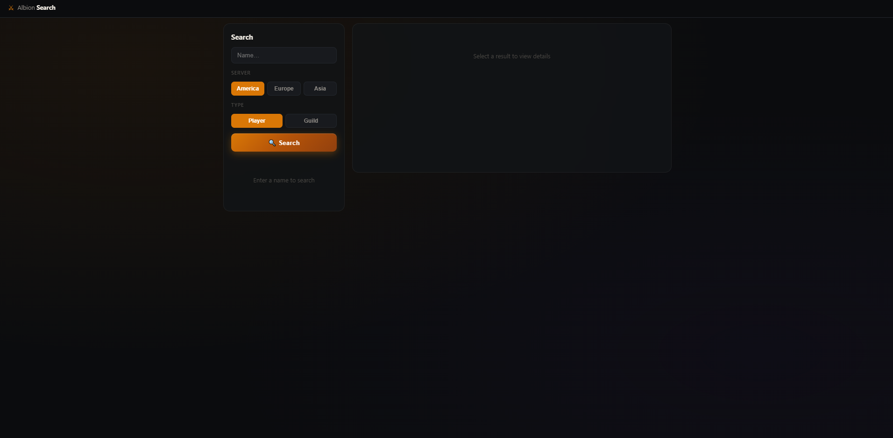
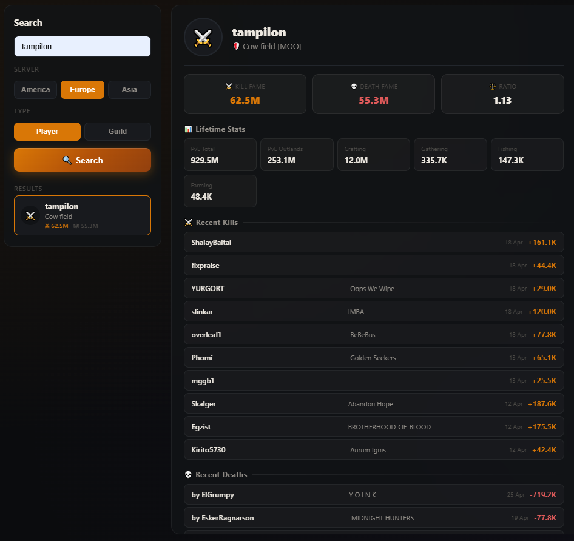
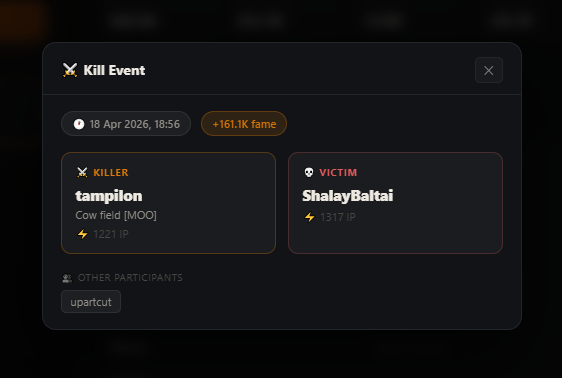

# Albion Online — Player & Guild Stats

A web app to search Albion Online players and guilds, view kill/death history and lifetime stats.

Built with Python (Flask) as a proxy for the official Albion Online API.


---

---

---

## Features

- Search players and guilds by name
- Switch between **America**, **Europe**, and **Asia** servers
- Player profile: Kill Fame, Death Fame, K/D ratio, lifetime PvE / Crafting / Gathering stats
- Recent kills & deaths with clickable event details (killer, victim, item power, participants)
- Guild profile: Kill Fame, Death Fame, member count, founder, alliance info
- Fully responsive (mobile friendly)

---

## Installation

**Requirements:** Python 3.8+

```bash
git clone https://github.com/mberkesnmz/AlbionOnline-Player-Guild-Stats.git
cd AlbionOnline-Player-Guild-Stats
pip install -r requirements.txt
python app.py
```

Then open [http://localhost:5001](http://localhost:5001) in your browser.

---

## How it works

The app acts as a proxy between the browser and the Albion Online gameinfo API, bypassing CORS restrictions.

| Server | API Base |
|--------|----------|
| America | `gameinfo.albiononline.com` |
| Europe | `gameinfo-ams.albiononline.com` |
| Asia | `gameinfo-sgp.albiononline.com` |

---

## Tech Stack

- **Backend:** Python, Flask
- **Frontend:** Vanilla HTML / CSS / JavaScript

---

## License

MIT
